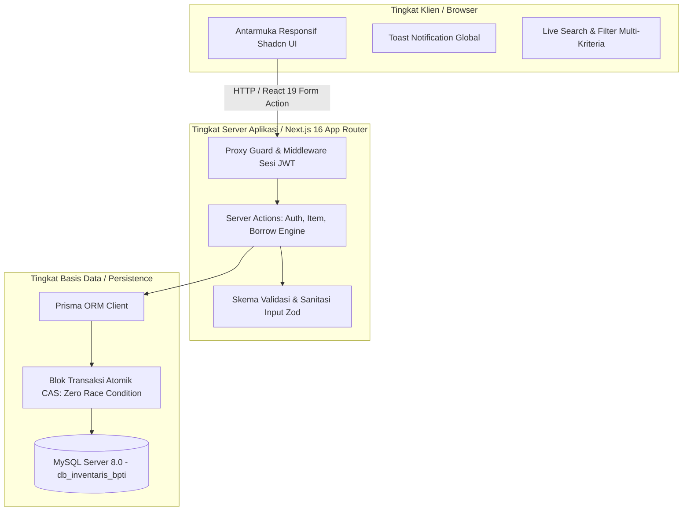
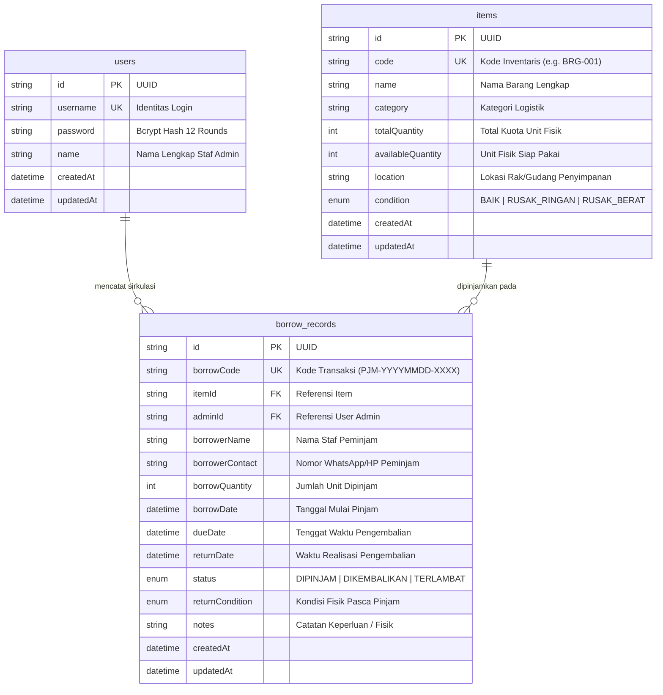

# SISTEM INFORMASI PENGELOLAAN BARANG INVENTARIS KANTOR
## Balai Pengembangan Talenta Indonesia (BPTI) — Kemendikbudristek RI & UHAMKA
### Dokumentasi Teknis, Arsitektur Sistem, Manual Operasional & Panduan Pengujian

---

## 1. Ringkasan Eksekutif & Gambaran Umum

Sistem Informasi Pengelolaan Barang Inventaris Kantor BPTI UHAMKA adalah platform web administratif tingkat korporat/pemerintahan yang dirancang khusus untuk mencatat ribuan unit aset logistik, mengelola mutasi sirkulasi peminjaman staf, memantau batas waktu pengembalian (*due date*), serta menjaga integritas stok fisik secara *real-time* dan akuntabel.

Sistem dioperasikan pada lingkungan jaringan lokal (*On-Premise Intranet*) dengan model akses administrator tunggal (*Single-Role Authentication*) untuk menjamin keamanan kendali aset kantor.

---

## 2. Arsitektur Perangkat Lunak (*Three-Tier Architecture*)

Sistem dibangun dengan memisahkan tanggung jawab secara tegas (*Separation of Concerns*):



### Spesifikasi Tumpukan Teknologi (*Tech Stack*):
- **Framework Aplikasi:** Next.js 16.3.7 (App Router, Turbopack, React 19.2 Server Components & Actions)
- **Bahasa Pemrograman:** TypeScript 5.x (Strict Type Checking)
- **Styling & Desain:** Tailwind CSS v4 (@theme inline OKLCH, Shadcn UI Anti AI-Slop)
- **Tipografi:** Geist Sans & Geist Mono (Vercel)
- **Basis Data:** MySQL Server v8.0 / MariaDB (Port 3306)
- **Object-Relational Mapping (ORM):** Prisma ORM v5.22.0
- **Keamanan:** Bcrypt.js (Salt rounds 12), Jose JWT HS256 HttpOnly Cookie
- **Ikonografi:** Lucide React (Vektor baku tanpa emoji dekoratif)

---

## 3. Matriks Pembagian Peran Rekayasa Tim Pengembang

Mengacu pada *Project Charter* dan dokumen *SRS (Software Requirements Specification)*, rekayasa sistem ini dikerjakan oleh tim 4 mahasiswa PKL:

| Peran Rekayasa | Fokus Tanggung Jawab Utama | Berkas Implementasi Terkait |
| :--- | :--- | :--- |
| **Dev 1 (Lead Project, DB & Security)** | Perancangan skema relasional, keamanan Bcrypt, JWT, Route Guard, dan dokumentasi resmi. | `prisma/schema.prisma`, `lib/auth.ts`, `lib/session.ts`, `proxy.ts`, `README.md` |
| **Dev 2 (Frontend Specialist & Validation)** | Pembuatan layout dasbor, komponen modal, skema validasi Zod berbahasa Indonesia baku. | `app/(dashboard)/**`, `components/items/item-modal.tsx`, `lib/validations/**` |
| **Dev 3 (Backend Engineer & Circulation)** | Logika mutasi stok atomik, isolasi race condition, agregasi metrik, dan proteksi foreign key. | `actions/borrow-actions.ts`, `actions/item-actions.ts`, `prisma/seed.ts` |
| **Dev 4 (QA/QC, Integration & Anti-Slop)** | Pengujian otomatis UAT, audit 35 aturan Anti AI-Slop, sistem Toast notification native. | `scripts/run-phase3-uat.ts`, `scripts/scan.mjs`, `components/ui/toast.tsx` |

---

## 4. Prasyarat Lingkungan Operasional

Sebelum menjalankan aplikasi, pastikan komputer server/lokal telah terpasang:
1. **Node.js LTS**: Versi 20.x, 22.x, atau 24.x (disarankan v24.x).
2. **Package Manager**: `pnpm` versi 9.x atau 11.x (`corepack enable && corepack prepare pnpm@latest --activate`).
3. **Database Server**: MySQL Server v8.0 atau MariaDB aktif pada port `3306`.
4. **Browser Modern**: Google Chrome, Mozilla Firefox, Microsoft Edge, atau Safari.

---

## 5. Panduan Instalasi & Setup Langkah demi Langkah

### Langkah 1: Kloning / Akses Repositori
```bash
cd c:/bpti-project-inventaris
```

### Langkah 2: Instalasi Dependensi
```bash
pnpm install
```

### Langkah 3: Konfigurasi Variabel Lingkungan (`.env`)
Pastikan berkas `.env` berada di direktori root dengan konfigurasi berikut:
```env
DATABASE_URL="mysql://root:@localhost:3306/db_inventaris_bpti"
SESSION_SECRET="bpti-inventory-secure-session-secret-key-2026-min-32-chars"
NODE_ENV="development"
```

### Langkah 4: Sinkronisasi Skema Basis Data
Terapkan skema tabel relasional ke basis data MySQL:
```bash
pnpm db:push
```

### Langkah 5: Seeding Data Awal (Akun Admin & Master Aset)
Inisialisasi akun administrator dan data master barang bawaan BPTI:
```bash
pnpm db:seed
```

### Langkah 6: Menjalankan Server Pengembangan
```bash
pnpm dev
```
Buka peramban pada alamat `http://localhost:3000`.

---

## 6. Kredensial Otentikasi Bawaan (*Default Credentials*)

Gunakan akun berikut untuk masuk ke sistem:
- **URL Login:** `http://localhost:3000/login`
- **Username:** `admin`
- **Password:** `admin123`
- **Masa Berlaku Sesi:** 7 hari kalender (diperbarui otomatis).

---

## 7. Kamus Basis Data Relasional (ERD & Tabel)



### Aturan Integritas Matematika Persamaan Stok:
$$\text{Total Unit Fisik} = \text{Unit Sedang Dipinjam} + \text{Unit Siap Pakai}$$
Persamaan ini dijaga secara mutlak oleh blok transaksi `prisma.$transaction`.

---

## 8. Manual Operasional Pengguna (SOP Admin)

### SOP-01: Pendaftaran Master Aset Baru (FR-ITEM-01)
1. Buka menu **Master Barang** (`/barang`).
2. Klik tombol **Tambah Barang**.
3. Isi kolom Kode Barang (format alfanumerik bebas spasi, misal `BRG-006`), Kategori, Nama Barang, Total Unit Fisik, Kondisi Fisik, dan Lokasi Simpan.
4. Klik **Tambah Barang**. Toast notifikasi hijau akan mengonfirmasi pendaftaran aset. Unit siap pakai otomatis sama dengan total unit fisik.

### SOP-02: Transaksi Sirkulasi Peminjaman Aset (FR-TRX-01)
1. Buka menu **Sirkulasi Peminjaman** (`/sirkulasi`).
2. Klik tombol **Catat Peminjaman**.
3. Pilih barang yang diinginkan dari menu dropdown (tersedia informasi kuota unit siap pakai).
4. Masukkan Nama Staf Peminjam, Nomor Kontak WhatsApp/HP, Jumlah Unit, Tenggat Waktu Pengembalian, dan Catatan Keperluan.
5. Klik **Konfirmasi Peminjaman**. Sistem secara atomik mengurangi kuota `availableQuantity` dan menerbitkan kode transaksi `PJM-YYYYMMDD-XXXX`.

### SOP-03: Pengembalian Aset & Inspeksi Kondisi Fisik (FR-TRX-02)
1. Buka menu **Sirkulasi Peminjaman** (`/sirkulasi`).
2. Temukan transaksi yang berstatus `Dipinjam`, lalu klik tombol **Kembalikan**.
3. Pilih kondisi fisik unit yang diserahkan kembali (*BAIK*, *RUSAK RINGAN*, atau *RUSAK BERAT*).
4. Tambahkan catatan kondisi bila terdapat perubahan fisik pada unit.
5. Klik **Konfirmasi Pengembalian**. Sistem memulihkan kuota unit siap pakai dan memperbarui status menjadi `Selesai Dikembalikan`.

### SOP-04: Penanganan Peringatan Keterlambatan Sirkulasi (FR-UI-01)
1. Periksa halaman **Ringkasan Dasbor** (`/`).
2. Jika ada transaksi yang melewati tenggat waktu kembali (*due date*), banner peringatan merah akan muncul di bagian atas dasbor dengan jumlah transaksi terlambat.
3. Klik tombol **Tinjau Transaksi** untuk langsung menuju ke daftar peminjaman terlambat guna melakukan penagihan fisik kepada staf terkait.

### SOP-05: Pencarian & Penyaringan Multi-Kriteria (FR-ITEM-02 & FR-TRX-03)
- Pada menu Master Barang: Gunakan kotak pencarian instan (*live search*) untuk memfilter data berdasarkan kode, nama, atau lokasi tanpa perlu memuat ulang peramban. Filter kategori dan filter kondisi fisik dapat dikombinasikan secara bebas.
- Pada menu Sirkulasi: Filter transaksi berdasarkan status (*Semua Status*, *Sedang Dipinjam*, *Selesai Dikembalikan*, atau *Terlambat Pengembalian*).

---

## 9. Rangkaian Perintah Skrip Resmi (*CLI Utility Scripts*)

Repositori ini dilengkapi dengan perintah skrip terstandardisasi pada `package.json`:

| Perintah | Deskripsi Fungsi |
| :--- | :--- |
| `pnpm dev` | Menjalankan server aplikasi Next.js dalam mode pengembangan lokal (`localhost:3000`). |
| `pnpm build` | Mengompilasi aplikasi untuk lingkungan produksi menggunakan Turbopack. |
| `pnpm start` | Menjalankan server build produksi lokal. |
| `pnpm typecheck` | Memvalidasi seluruh tipe TypeScript secara ketat tanpa menghasilkan berkas keluaran. |
| `pnpm lint` | Menjalankan pemeriksaan ESLint pada seluruh berkas proyek. |
| `pnpm test:uat` | Menjalankan test runner otomatis 11 kasus uji (UAT-01 s/d UAT-10 + STRESS-01) secara terisolasi. |
| `pnpm db:check` | Memeriksa agregat kuota stok fisik dan riwayat sirkulasi terkini langsung ke basis data MySQL. |
| `pnpm scan:slop` | Mengaudit antarmuka pengguna terhadap 35 aturan visual Anti AI-Slop menggunakan engine scanner. |
| `pnpm db:push` | Menerapkan perubahan skema Prisma ke basis data MySQL secara langsung. |
| `pnpm db:seed` | Menjalankan seeding akun default admin dan master barang BPTI. |
| `pnpm db:studio` | Membuka antarmuka grafis visual Prisma Studio untuk inspeksi basis data di peramban. |

---

## 10. Jaminan Keamanan Sistem & Ketahanan Transaksi ACID

1. **Zero Race Condition (Conditional CAS Mutex):**
   Pengurangan kuota unit menggunakan klausa `WHERE availableQuantity >= borrowQuantity`. Transaksi gagal otomatis di tingkat basis data bila kuota tidak mencukupi, mencegah stok negatif (*zero negative stock*).
2. **Idempotensi Pengembalian (Anti Double-Return):**
   Pengembalian dibatasi oleh predikat `WHERE status = 'DIPINJAM'`. Percobaan kedua pada transaksi yang sama ditolak seketika, mencegah manipulasi stok berlebih.
3. **Integritas Relasional MySQL (`onDelete: Restrict`):**
   Barang yang memiliki riwayat transaksi peminjaman tidak dapat dihapus dari tabel master demi menjaga akuntabilitas audit sejarah aset negara.
4. **Keamanan Kredensial & Sesi Admin:**
   Sandi di-hash dengan Bcrypt 12 rounds (kebal terhadap *rainbow table* dan *timing attack*). Token sesi JWT menggunakan algoritma `HS256` yang disimpan dalam cookie `HttpOnly`, `SameSite=Lax`, dan `Path=/`.

---

## 11. Pengesahan & Serah Terima Proyek

Dokumentasi ini disusun sebagai bagian integral dari laporan akhir Praktik Kerja Lapangan (PKL) Program Studi Teknik Informatika / Sistem Informasi Universitas Muhammadiyah Prof. DR. HAMKA (UHAMKA) yang bermitra dengan Balai Pengembangan Talenta Indonesia (BPTI) Pusat Prestasi Nasional Kemendikbudristek RI.
